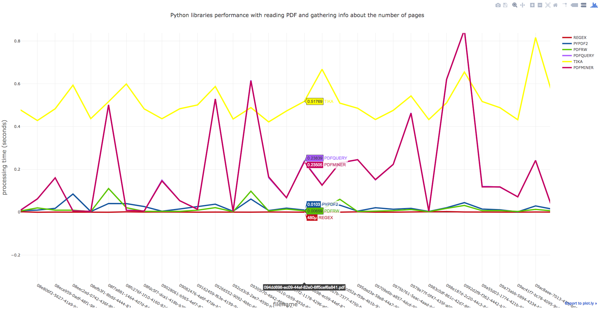
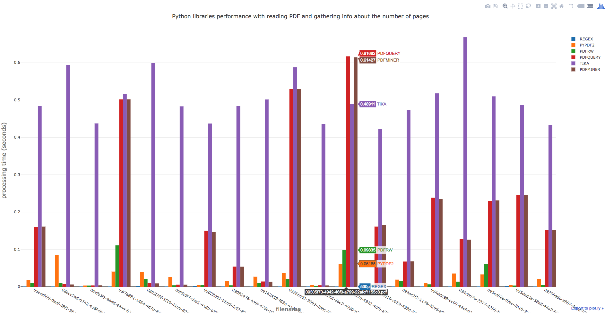

Python-PDF libraries performance tests
======================================
Checking performance with reading PDF and:
- **gathering info about the number of pages using python libraries.**
- **... some day ...**

**Current stable version:** v1.1

**Release date:** 07.08.2018

### Author:
Maciej Januszewski (maciek@mjanuszewski.pl)

### Pre-requirements:

* **Firstly run Apache-Tika Server (for Tika purposes):** 
```
docker pull logicalspark/docker-tikaserver
docker run -d -p 9998:9998 logicalspark/docker-tikaserver
```

### Running as human:
```
./run.py <path/to/pdfs_data/>
```


### Sample plots outputs:
**- Scatter plot:**


**- Boxes plot:**

